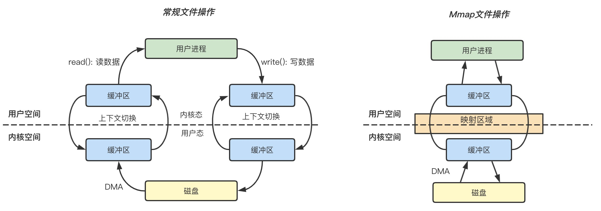

# mandodb

> 🤔 A minimize Time Series Database, written from scratch as a learning project.

时序数据库（TSDB: Time Series Database）大多数时候都是为了满足监控场景的需求，这里先介绍两个概念：
* 数据点（Point）: 时序数据的数据点是一个包含 (Timestamp:int64, Value:float64) 的二元组。
* 时间线（Series）: 不同标签（Label）的组合称为不同的时间线，如 
```shell
series1: {"__name__": "netspeed", "host": "localhost", "iface": "eth0"}
series2: {"__name__": "netspeed", "host": "localhost", "iface": "eth1"}
```

[Prometheus](https://prometheus.io/), [InfluxDB](https://www.influxdata.com/), [M3](https://m3db.io/), [TimescaleDB](https://www.timescale.com/) 都是时下流行的 TSDB。时序数据的压缩算法很大程度上决定了 TSDB 的性能，以上几个项目的实现都参考了 Facebook 2015 年发表的论文[《Gorilla: A fast, scalable, in-memory time series database》](http://www.vldb.org/pvldb/vol8/p1816-teller.pdf) 中提到的差值算法，该算法平均可以将 16 字节的数据点压缩成 1.37 字节，下文会介绍。

**Who's mando?**

> Din Djarin, also known as "the Mandalorian" or simply "Mando," was a human male Mandalorian who worked as a famous bounty hunter during the New Republic Era.

<p align="center"><image src="./images/mando.png" width="620px"></p>

**What's mandodb?**

作为一名监控系统开发人员，自然要对时序数据库有所了解。[mandodb](https://github.com/chenjiandongx/mandodb) 是我在研究过程中实现的一个最小化的 TSDB，从概念上来讲它还算不上是一个完整的 TSDB，因为它：

* 没有实现自己的查询引擎（实现难度大）
* 缺少磁盘归档文件 Compact 操作（天气好的话会实现）
* 没有 WAL 作为灾备保证高可用（心情好的话会实现）

mandodb 主要受到了两个项目的启发。**本项目仅限于学习用途，未经生产环境测试验证！**

* [nakabonne/tstorage](https://github.com/nakabonne/tstorage)
* [prometheus/prometheus](https://github.com/prometheus/prometheus)

prometheus 的核心开发者 Fabian Reinartz 写了一篇文章 [《Writing a Time Series Database from Scratch》](https://fabxc.org/tsdb/) 来介绍 prometheus TSDB 的演变过程，非常值得一读，强烈推荐。

## 📖 TOC

* **💡 数据模型 & API**
* **🛠 配置选项**
* **🔖 用法示例**
* **🧮 Gorilla 差值算法**
* **📝 数据写入**
* **🖇 Mmap 内存映射**
* **📍 索引设计**
* **🗂 存储布局**
* **❓ FAQ**

## 💡 数据模型 & API 文档

**数据模型定义**
```golang
// Point 表示一个数据点 (ts, value) 二元组
type Point struct {
	Ts    int64 // in seconds
	Value float64
}

// Label 代表一个标签组合
type Label struct {
	Name  string
	Value string
}

// Row 一行时序数据 包括数据点和标签组合
type Row struct {
	Metric string
	Labels LabelSet
	Point  Point
}

// LabelSet 表示 Label 组合
type LabelSet []Label

// LabelMatcher Label 匹配器 支持正则
type LabelMatcher struct {
	Name   string
	Value  string
	IsRegx bool
}

// LabelMatcherSet 表示 LabelMatcher 组合
type LabelMatcherSet []LabelMatcher
```

**API**
```golang
// InsertRows 写数据
InsertRows(rows []*Row) error 

// QueryRange 查询时序数据点
QueryRange(metric string, lms LabelMatcherSet, start, end int64) ([]MetricRet, error)

// QuerySeries 查询时序序列组合
QuerySeries(lms LabelMatcherSet, start, end int64) ([]map[string]string, error)

// QueryLabelValues 查询标签值
QueryLabelValues(label string, start, end int64) []string
```

## 🛠 配置选项

配置项在初始化 TSDB 的时候设置。

```golang
// WithMetaSerializerType 设置 Metadata 数据的序列化类型
// 目前只提供了 BinaryMetaSerializer
WithMetaSerializerType(t MetaSerializerType) Option 

// WithMetaBytesCompressorType 设置字节数据的压缩算法
// 目前提供了
// * 不压缩: NoopBytesCompressor（默认）
// * ZSTD: ZstdBytesCompressor
// * Snappy: SnappyBytesCompressor
WithMetaBytesCompressorType(t BytesCompressorType) Option

// WithOnlyMemoryMode 设置是否默认只存储在内存中
// 默认为 false
WithOnlyMemoryMode(memoryMode bool) Option

// WithEnabledOutdated 设置是否支持乱序写入 此特性会增加资源开销 但会提升数据完整性
// 默认为 true
WithEnabledOutdated(outdated bool) Option

// WithMaxRowsPerSegment 设置单 Segment 最大允许存储的点数
// 默认为 19960412（夹杂私货 🐶）
WithMaxRowsPerSegment(n int64) Option

// WithDataPath 设置 Segment 持久化存储文件夹
// 默认为 "."
WithDataPath(d string) Option

// WithRetention 设置 Segment 持久化数据保存时长
// 默认为 7d
WithRetention(t time.Duration) Option

// WithWriteTimeout 设置写入超时阈值
// 默认为 30s
WithWriteTimeout(t time.Duration) Option

// WithLoggerConfig 设置日志配置项
// logger: github.com/chenjiandongx/logger
WithLoggerConfig(opt *logger.Options) Option
```

## 🔖 用法示例

```golang
package main

import (
	"fmt"
	"time"

	"github.com/chenjiandongx/mandodb"
)

func main() {
	store := mandodb.OpenTSDB(
		mandodb.WithOnlyMemoryMode(true),
		mandodb.WithWriteTimeout(10*time.Second),
	)
	defer store.Close()

	// 插入数据
	_ = store.InsertRows([]*mandodb.Row{
		{
			Metric: "cpu.busy",
			Labels: []mandodb.Label{
				{Name: "node", Value: "vm1"},
				{Name: "dc", Value: "gz-idc"},
			},
			Point: mandodb.Point{Ts: 1600000001, Value: 0.1},
		},
		{
			Metric: "cpu.busy",
			Labels: []mandodb.Label{
				{Name: "node", Value: "vm2"},
				{Name: "dc", Value: "sz-idc"},
			},
			Point: mandodb.Point{Ts: 1600000001, Value: 0.1},
		},
	})

	time.Sleep(time.Millisecond)

	// 时序数据查询
	data, _ := store.QueryRange("cpu.busy", nil, 1600000000, 1600000002)
	fmt.Printf("data: %+v\n", data)
	// output:
	// data: [{Labels:{__name__="cpu.busy", dc="gz-idc", node="vm1"} Points:[{Ts:1600000001 Value:0.1}]}]

	// 查询 Series
	// __name__ 是 metric 名称在 TSDB 中的 Label Key
	ser, _ := store.QuerySeries(
        mandodb.LabelMatcherSet{{Name: "__name__", Value: "cpu.busy"}}, 1600000000, 1600000002)
	for _, d := range ser {
		fmt.Printf("data: %+v\n", d)
	}
	// output:
	// data: map[__name__:cpu.busy dc:gz-idc node:vm1]
	// data: map[__name__:cpu.busy dc:sz-idc node:vm2]

	// 查询标签值
	lvs := store.QueryLabelValues("node", 1600000000, 1600000002)
	fmt.Printf("data: %+v\n", lvs)
	// output:
	// data: [vm1 vm2]
}
```

下面是我对这段时间学习内容的整理，尝试完整介绍如何从零开始实现一个小型的 TSDB。

<p align="center"><image src="./images/教我做事.png" width="320px"></p>

**我本身并没有数据库开发的背景，某些描述可能并不那么准确，所以欢迎 ~~实名 diss~~ 指正。**

## 🧮 Gorilla 差值算法

Gorilla 论文 4.1 小节介绍了压缩算法，先整体看一下压缩方案，T/V 是紧挨存储的，'0'/'10'/'11' 表示控制位。

***Figure: Gorilla 压缩算法***

<p align="center"><image src="./images/gorilla.png" width="600px"></p>

**Timestamp DOD 压缩：**

在时序的场景中，每个时序点都有一个对应的 Timestamp，一条时序序列中相邻数据点的间隔是有规律可循的。一般来讲，监控数据的采集都是会以固定的时间间隔进行的，所以就可以用差值来记录时间间隔，更进一步，我们可以用差值的差值来记录以此来减少存储空间。

```golang
t1: 1627401800; t2: 1627401810; t3: 1627401820; t4: 1627401830
--------------------------------------------------------------
// 差值：delta
t1: 1627401800; (t2-t1)d1: 10; (t3-t2)d2: 10; (t4-t3)d3: 10; 
--------------------------------------------------------------
// 差值的差值：delta of delta
t1: 1627401800; dod1: 0; dod2: 0; dod3: 0; 
```

实际环境中当然不可能每个间隔都这么均匀，由于网络延迟等其他原因，差值会有波动。

**Value XOR 压缩：**

***Figure: IEEE 浮点数以及 XOR 计算结果***

<p align="center"><image src="./images/float64.png" width="600px"></p>

当两个数据点数值值比较接近的话，通过异或操作计算出来的结果是比较相似的，利用这点就可以通过记录前置零和后置零个数以及数值部分来达到压缩空间的目的。

下面通过算法实现来介绍，代码来自项目 [dgryski/go-tsz](https://github.com/dgryski/go-tsz)。代码完全按照论文中给出的步骤来实现。

```golang
// New 初始化 block 这里会将第一个原始时间戳写入到 block 中
func New(t0 uint32) *Series {
	s := Series{
		T0:      t0,
		leading: ^uint8(0),
	}

	s.bw.writeBits(uint64(t0), 32)
	return &s
}

// Push 负责写入时序数据
func (s *Series) Push(t uint32, v float64) {
	// ....
	// 如果是第一个数据点的话写入原始数据后直接返回
	if s.t == 0 {
		s.t = t
		s.val = v
		s.tDelta = t - s.T0 // 实际上这里为 0

		// The block header stores the starting time stamp, t-1（前一个时间戳）,
		// which is aligned to a two hour window; the first time
		// stamp, t0, in the block is stored as a delta from t−1 in 14 bits.
        
		// 用 14 个 bit 写入时间戳差值
		s.bw.writeBits(uint64(s.tDelta), 14)
		// 原始数据点完整写入
		s.bw.writeBits(math.Float64bits(v), 64)
		return
	}

	tDelta := t - s.t
	dod := int32(tDelta - s.tDelta) // 计算差值的差值 Detla of Delta

	// 下面开始就处理非第一个数据点的情况了
	switch {
		// If D is zero, then store a single ‘0’ bit
		// 如果是零的话 那直接用 '0' 一个字节就可以直接表示
	case dod == 0:
		s.bw.writeBit(zero)

		//  If D is between [-63, 64], store ‘10’ followed by the value (7 bits)
	case -63 <= dod && dod <= 64:
		s.bw.writeBits(0x02, 2) // 控制位 '10'
		s.bw.writeBits(uint64(dod), 7) // 7bits 可以表示 [-63, 64] 的范围

		// If D is between [-255, 256], store ‘110’ followed by the value (9 bits)
	case -255 <= dod && dod <= 256:
		s.bw.writeBits(0x06, 3) // 控制位 '110'
		s.bw.writeBits(uint64(dod), 9)

		// if D is between [-2047, 2048], store ‘1110’ followed by the value (12 bits)
	case -2047 <= dod && dod <= 2048:
		s.bw.writeBits(0x0e, 4) // 控制位 '1110'
		s.bw.writeBits(uint64(dod), 12)

		// Otherwise store ‘1111’ followed by D using 32 bits
	default:
		s.bw.writeBits(0x0f, 4) // 其余情况控制位均用 '1111'
		s.bw.writeBits(uint64(dod), 32)
	}

	// 到这里 (T, V) 中的时间戳已经写入完毕了 接下来是写 V 部分

	// 先计算两个值的异或结果
	vDelta := math.Float64bits(v) ^ math.Float64bits(s.val)

	// If XOR with the previous is zero (same value), store single ‘0’ bit
	// 如果前后两个值相等的话 直接用 '0' 1 个 bit 就可以表示
	// 所以如果上报的时序数据是 1 或者 0 这种的话 占用的内存会非常少

	// zero = '0'; one = '1'
	if vDelta == 0 {
		s.bw.writeBit(zero)
	} else {    // 非 0 情况那就要把控制位置为 1
		s.bw.writeBit(one)

		// 计算前置 0 和后置 0
		leading := uint8(bits.LeadingZeros64(vDelta))
		trailing := uint8(bits.TrailingZeros64(vDelta))

		// clamp number of leading zeros to avoid overflow when encoding
		if leading >= 32 {
			leading = 31
		}

		// (Control bit ‘0’) If the block of meaningful bits
		// falls within the block of previous meaningful bits,
		// i.e., there are at least as many leading zeros and
		// as many trailing zeros as with the previous value,
		// use that information for the block position and
		// just store the meaningful XORed value.

		// 如果前置 0 不小于上一个值计算的异或结果的前置 0 且后置 0 也不小于上一个值计算的异或结果的后置 0
		if s.leading != ^uint8(0) && leading >= s.leading && trailing >= s.trailing { // => 控制位 '10'
			s.bw.writeBit(zero)
			// 记录异或值非零部分
			s.bw.writeBits(vDelta>>s.trailing, 64-int(s.leading)-int(s.trailing))
		} else { // => 控制位 '11'

			// (Control bit ‘1’) Store the length of the number
			// of leading zeros in the next 5 bits, then store the
			// length of the meaningful XORed value in the next
			// 6 bits. Finally store the meaningful bits of the XORed value.
			s.leading, s.trailing = leading, trailing

			// 其他情况控制位置为 1 并用接下来的 5bits 记录前置 0 个数
			s.bw.writeBit(one)
			s.bw.writeBits(uint64(leading), 5)

			// 然后用接下来的 6bits 记录异或差值中的非零部分
			sigbits := 64 - leading - trailing
			s.bw.writeBits(uint64(sigbits), 6)
			s.bw.writeBits(vDelta>>trailing, int(sigbits))
		}
	}

	// 状态更新 至此（T, V）均已被压缩写入到内存中
	s.tDelta = tDelta
	s.t = t
	s.val = v
}

// 每个 block 的结尾会使用特殊标记用于标识
func finish(w *bstream) {
	// write an end-of-stream record
	w.writeBits(0x0f, 4)
	w.writeBits(0xffffffff, 32)
	w.writeBit(zero)
}
```

论文给出了不同 case 的 buckets 占比分布。

***Figure: Timestamp buckets distribution***

<p align="center"><image src="./images/ts-buckets.png" width="600px"></p>

***Figure: Value buckets distribution***

<p align="center"><image src="./images/v-buckets.png" width="600px"></p>

Timestamp buckets 中，前后两个时间戳差值相同的比例高达 96.39%，而在 Value buckets 中只用一个控制位的占比也达到了 59.06%，可见其压缩比之高。

论文还给出了一个重要结论，**数据压缩比随着时间的增长而增长，并在 120 个点的时候开始收敛到一个最佳值。**

***Figure: 压缩率曲线***

<p align="center"><image src="./images/compression-window.png" width="600px"></p>

Gorilla 差值算法也应用于我的另外一个项目 [chenjiandongx/tszlist](https://github.com/chenjiandongx/tszlist)，一种时序数据线程安全链表。

## 📝 数据写入

时序数据具有「垂直写，水平查」的特性，即同一时刻有多条时间线的数据不断被追加。但查询的时候往往是查某条时间线持续一段时间内的数据点。

```golang
series
  ^   
  │   . . . . . . . . . . . . . . . . .   . . . . .   {__name__="request_total", method="GET"}
  │     . . . . . . . . . . . . . . . . . . . . . .   {__name__="request_total", method="POST"}
  │         . . . . . . .
  │       . . .     . . . . . . . . . . . . . . . .                  ... 
  │     . . . . . . . . . . . . . . . . .   . . . .   
  │     . . . . . . . . . .   . . . . . . . . . . .   {__name__="errors_total", method="POST"}
  │           . . .   . . . . . . . . .   . . . . .   {__name__="errors_total", method="GET"}
  │         . . . . . . . . .       . . . . .
  │       . . .     . . . . . . . . . . . . . . . .                  ... 
  │     . . . . . . . . . . . . . . . .   . . . . 
  v
    <-------------------- time --------------------->
```

时序数据跟时间是强相关的（不然还叫时序数据？🧐），即大多数查询其实只会查询**最近时刻**的数据，这里的「最近」是个相对概念。所以没必要维护一条时间线的完整生命周期，特别是在 Kubernetes 这种云原生场景，Pod 随时有可能会被扩缩容，也就意味着一条时间线的生命周期可能会很短。如果我们一直记录着所有的时间线的索引信息，那么随着时间的推移，数据库里的时间线的数量会呈现一个线性增长的趋势 😱，会极大地影响查询效率。

这里引入一个概念「序列分流」，这个概念描述的是一组时间序列变得不活跃，即不再接收数据点，取而代之的是有一组新的活跃的序列出现的场景。

```golang
series
  ^
  │   . . . . . .
  │   . . . . . .
  │   . . . . . .
  │               . . . . . . .
  │               . . . . . . .
  │               . . . . . . .
  │                             . . . . . .
  │                             . . . . . .
  │                                         . . . . .
  │                                         . . . . .
  │                                         . . . . .
  v
    <-------------------- time --------------------->
```

我们将多条时间线的数据按一定的时间跨度切割成多个小块，每个小块本质就是一个独立小型的数据库，这种做法另外一个优势是清除过期操作的时候非常方便，只要将整个块给删了就行 👻（梭哈是一种智慧）。内存中保留最近两个小时的热数据（Memory Segment），其余数据持久化到磁盘(Disk Segment)。

***Figure: 序列分块***

<p align="center"><image src="./images/分块.png" width="620px"></p>

DiskSegment 使用的是 `AVL Tree` 实现的列表，可在插入时排序。为什么不用更加高大上的红黑树？因为不好实现...

<p align="center"><image src="./images/又不是不能用.png" width="320px"></p>

当 Memory Segment 达到归档条件的时候，会创建一个新的内存块并异步将刚归档的块写入到磁盘，同时会使用 mmap 将磁盘文件句柄映射到内存中。代码实现如下。

```golang
func (tsdb *TSDB) getHeadPartition() (Segment, error) {
	tsdb.mut.Lock()
	defer tsdb.mut.Unlock()

	if tsdb.segs.head.Frozen() {
		head := tsdb.segs.head

		go func() {
			tsdb.wg.Add(1)
			defer tsdb.wg.Done()

			tsdb.segs.Add(head)

			t0 := time.Now()
			dn := dirname(head.MinTs(), head.MaxTs())

			if err := writeToDisk(head.(*memorySegment)); err != nil {
				logger.Errorf("failed to flush data to disk, %v", err)
				return
			}

			fname := path.Join(dn, "data")
			mf, err := mmap.OpenMmapFile(fname)
			if err != nil {
				logger.Errorf("failed to make a mmap file %s, %v", fname, err)
				return
			}

			tsdb.segs.Remove(head)
			tsdb.segs.Add(newDiskSegment(mf, dn, head.MinTs(), head.MaxTs()))
			logger.Infof("write file %s take: %v", fname, time.Since(t0))
		}()

		tsdb.segs.head = newMemorySegment()
	}

	return tsdb.segs.head, nil
}
```

***Figure: Memory Segment 两部分数据***

<p align="center"><image src="./images/memory-segment.png" width="500px"></p>

写入的时候支持数据时间回拨，也就是支持**有限的**乱序数据写入，实现方案是在内存中对还没归档的每条时间线维护一个链表（同样使用 AVL Tree 实现），当数据点的时间戳不是递增的时候存储到链表中，查询的时候会将两部分数据合并查询，持久化的时候也会将两者合并写入。

## 🖇 Mmap 内存映射

> [mmap](https://www.cnblogs.com/fnlingnzb-learner/p/6955591.html) 是一种将磁盘文件映射到进程的虚拟地址空间来实现对文件读取和修改操作的技术。

从 Linux 角度来看，操作系统的内存空间被分为「内核空间」和「用户空间」两大部分，其中内核空间和用户空间的空间大小、操作权限以及核心功能都不相同。这里的内核空间是指操作系统本身使用的内存空间，而用户空间则是提供给各个进程使用的内存空间。由于用户进程不具有访问内核资源的权限，例如访问硬件资源，因此当一个用户进程需要使用内核资源的时候，就需要通过 [系统调用](https://zh.wikipedia.org/zh-hans/系统调用) 来完成。

<p align="center"><image src="./images/我不理解.png" width="320px"></p>

虚拟内存细节可以阅读 [《虚拟内存精粹》](https://strikefreedom.top/memory-management--virtual-memory) 这篇文章。

***Figure: 常规文件操作和 mmap 操作的区别***



**常规文件操作**

**读文件：** 用户进程首先执行 `read(2)` 系统调用，会进行系统上下文环境切换，从用户态切换到内核态，之后由 DMA 将文件数据从磁盘读取到内核缓冲区，再将内核空间缓冲区的数据复制到用户空间的缓冲区中，最后 `read(2)` 系统调用返回，进程从内核态切换到用户态，整个过程结束。

**写文件：** 用户进程发起 `write(2)` 系统调用，从用户态切换到内核态，将数据从用户空间缓冲区复制到内核空间缓冲区，接着 `write(2)` 系统调用返回，同时进程从内核态切换到用户态，数据从内核缓冲区写入到磁盘，整个过程结束。

**mmap 操作**

mmap 内存映射的实现过程，总的来说可以分为三个阶段：

1. 进程启动映射过程，并在虚拟地址空间中为映射创建虚拟映射区域。
2. 执行内核空间的系统调用函数 mmap，建立文件物理地址和进程虚拟地址的一一映射关系。
3. 进程发起对这片映射空间的访问，引发缺页异常，实现文件内容到物理内存的拷贝。

**📣 小结**

常规文件操作为了提高读写效率和保护磁盘，使用了页缓存机制。这样造成读文件时需要先将文件页从磁盘拷贝到页缓存中，由于页缓存处在内核空间，不能被用户进程直接寻址，所以还需要将页缓存中数据页再次拷贝到内存对应的用户空间中。这样，通过了两次数据拷贝过程，才能完成进程对文件内容的获取任务。写操作也是一样，待写入的 buffer 在内核空间不能直接访问，必须要先拷贝至内核空间对应的主存，再写回磁盘中（延迟写回），也是需要两次数据拷贝。

而使用 mmap 操作文件，创建新的虚拟内存区域和建立文件磁盘地址和虚拟内存区域映射这两步，没有任何文件拷贝操作。而之后访问数据时发现内存中并无数据而发起的缺页异常过程，可以通过已经建立好的映射关系，只使用一次数据拷贝，就从磁盘中将数据传入内存的用户空间中，供进程使用。

<p align="center"><image src="./images/理解成功.png" width="320px"></p>

😅 总而言之，常规文件操作需要从磁盘到页缓存再到用户主存的两次数据拷贝。而 mmap 操控文件只需要从磁盘到用户主存的一次数据拷贝过程。**mmap 的关键点是实现了「用户空间」和「内核空间」的数据直接交互而省去了不同空间数据复制的开销**。

## 📍 索引设计

**TSDB 的查询，是通过 Label 组合来锁定到具体的时间线进而确定分块偏移检索出数据。**

* Sid(MetricHash/-/LabelHash) 是一个 Series 的唯一标识。
* Label(Name/-/Value) => vm="node1"; vm="node2"; iface="eth0"。

在传统的关系型数据库，索引设计可能是这样的。

| Sid（主键） | Label1 | Label2 | Label3 | Label4 | ... | LabelN |
| ---- | ------ | ------ | ------ | ------ | --- | ------ |
| sid1 | × | × | × |  | ... | × |
| sid2 |  | × | × | × | ... | × |  
| sid3 | × | × |  | × | ... | × |  
| sid4 | × |  | × | × | ... | × |

时序数据是 `NoSchema` 的，没办法提前建表和定义数据模型 🤔，因为我们要支持用户上报**任意 Label 组合**的数据，这样的话就没办法进行动态的扩展了。或许你会灵光一现 ✨，既然这样，那把 Labels 放一个字段拼接起来不就可以无限扩展啦，比如下面这个样子。

| Sid（主键） | Labels |
| ----- | ---- |
| sid1 | label1, label2, label3, ... |
| sid2 | label2, label3, label5, ... |
| sid3 | label4, label6, label9, ... |
| sid4 | label2, label3, label7, ... |

哟嚯，乍一看没毛病，靓仔窃喜。

<p align="center"><image src="./images/窃窃自喜.png" width="320px"></p>

不对，有问题 😨，要定位到其中的某条时间线，那我是不是得全表扫描一趟。而且这种设计还有另外一个弊病，就是会导致内存激增，Label 的 Name 和 Value 都可能是特别长的字符串。

那怎么办呢（🤡 靓仔沉默...），刹那间我的脑中闪过一个帅气的身影，没错，就是你，**花泽类**「只要倒立眼泪就不会流出来」。

<p align="center"><image src="./images/花泽类.png" width="320px"></p>

我悟了！要学会逆向思维 🙃，把 Label 当做主键，Sid 当做其字段不就好了。这其实有点类似于 ElasticSearch 中的倒排索引，主键为 Keyword，字段为 DocumentID。索引设计如下。

| Label（主键） | Sids |
| ----- | ---- |
| label1: {vm="node1"} | sid1, sid2, sid3, ... |
| label2: {vm="node2"} | sid2, sid3, sid5, ... |
| label3: {iface="eth0"} | sid3, sid5, sid9, ... |
| label4: {iface="eth1"} | sid2, sid3, sid7, ... |

Label 作为主键时会建立索引（Hashkey），查找的效率可视为 O(1)，再根据锁定的 Label 来最终确定想要的 Sid。举个例子，我们想要查找 `{vm="node1", iface="eth0"}` 的时间线的话就可以快速定位到 Sids（忽略其他 ... sid）。

```golang
sid1; sid2; sid3
sid2; sid3; sid5
```

两者求一个交集，就可以得到最终要查询的 Sid 为 `sid2` 和 `sid3`。🙂 Nice!

假设我们的查询只支持**相等匹配**的话，格局明显就小了 🤌。查询条件是 `{vm=~"node*", iface="eth0"}` 肿么办？对 label1、label2、label3 和 label4 一起求一个并集吗？显然不是，因为这样算的话那结果就是 `sid3`。

厘清关系就不难看出，**只要对相同的 Label Name 做并集然后再对不同的 Label Name 求交集就可以了**。这样算的正确结果就是 `sid3` 和 `sid5`。实现的时候用到了 Roaring Bitmap，一种优化的位图算法。

**Memory Segment 索引匹配**
```golang
func (mim *memoryIndexMap) MatchSids(lvs *labelValueSet, lms LabelMatcherSet) []string {
	// ...
	sids := newMemorySidSet()
	var got bool
	for i := len(lms) - 1; i >= 0; i-- {
		tmp := newMemorySidSet()
		vs := lvs.Match(lms[i])
		// 对相同的 Label Name 求并集
		for _, v := range vs {
			midx := mim.idx[joinSeparator(lms[i].Name, v)]
			if midx == nil || midx.Size() <= 0 {
				continue
			}

			tmp.Union(midx.Copy())
		}

		if tmp == nil || tmp.Size() <= 0 {
			return nil
		}

		if !got {
			sids = tmp
			got = true
			continue
		}

		// 对不同的 Label Name 求交集
		sids.Intersection(tmp.Copy())
	}

	return sids.List()
}
```

**Disk Segment 索引匹配**
```golang
func (dim *diskIndexMap) MatchSids(lvs *labelValueSet, lms LabelMatcherSet) []uint32 {
	// ...

	lst := make([]*roaring.Bitmap, 0)
	for i := len(lms) - 1; i >= 0; i-- {
		tmp := make([]*roaring.Bitmap, 0)
		vs := lvs.Match(lms[i])

		// 对相同的 Label Name 求并集
		for _, v := range vs {
			didx := dim.label2sids[joinSeparator(lms[i].Name, v)]
			if didx == nil || didx.set.IsEmpty() {
				continue
			}

			tmp = append(tmp, didx.set)
		}

		union := roaring.ParOr(4, tmp...)
		if union.IsEmpty() {
			return nil
		}

		lst = append(lst, union)
	}

	// 对不同的 Label Name 求交集
	return roaring.ParAnd(4, lst...).ToArray()
}
```

然而，确定相同的 LabelName 也是一个问题，因为 Label 本身就代表着 `Name:Value`，难不成我还要遍历所有 label 才能确定嘛，这不就又成了全表扫描？？？

<div align="center"><image src="./images/我不答应.png" width="320px"></div>

> 没有什么问题是一个索引解决不了的，如果有，那就再增加一个索引。 --- 鲁迅。

<div align="center"><image src="./images/鲁迅.png" width="320px"></div>

只要我们保存 Label 的 Name 对应的 Value 列表的映射关系即可高效解决这个问题。

| LabelName | LabelValue |
| -- | -- |
| vm | node1, node2, ... |
| iface | eth0, eth1, ... |

还是上面的 `{vm=~"node1|node2", iface="eth0"}` 查询，第一步通过正则匹配确定匹配到 `node1, node2`，第二步匹配到 `eth0`，再将 LabelName 和 LabelValue 一拼装，Label 就出来了，✌️ 完事！

桥豆麻袋！还有一个精彩的正则匹配优化算法没介绍。

<p align="center"><image src="./images/眼巴巴.png" width="320px"></p>

fastRegexMatcher 是一种优化的正则匹配器，算法来自 Prometheus。
```golang
// 思路就是尽量先执行前缀匹配和后缀匹配 能不用正则就不用正则
// 如 label 表达式为 {vm="node*"}
// 而我们此时内存中有 vm=node1, vm=node2, vm=foo, vm=bar，那这个时候只需要前缀匹配就能直接把 vm=foo,vm=bar 给过滤了
// 毕竟前缀匹配和后缀匹配的执行效率还是比正则高不少的
type fastRegexMatcher struct {
	re       *regexp.Regexp
	prefix   string
	suffix   string
	contains string
}

func newFastRegexMatcher(v string) (*fastRegexMatcher, error) {
	re, err := regexp.Compile("^(?:" + v + ")$")
	if err != nil {
		return nil, err
	}

	parsed, err := syntax.Parse(v, syntax.Perl)
	if err != nil {
		return nil, err
	}

	m := &fastRegexMatcher{
		re: re,
	}

	if parsed.Op == syntax.OpConcat {
		m.prefix, m.suffix, m.contains = optimizeConcatRegex(parsed)
	}

	return m, nil
}

// optimizeConcatRegex returns literal prefix/suffix text that can be safely
// checked against the label value before running the regexp matcher.
func optimizeConcatRegex(r *syntax.Regexp) (prefix, suffix, contains string) {
	sub := r.Sub

	// We can safely remove begin and end text matchers respectively
	// at the beginning and end of the regexp.
	if len(sub) > 0 && sub[0].Op == syntax.OpBeginText {
		sub = sub[1:]
	}
	if len(sub) > 0 && sub[len(sub)-1].Op == syntax.OpEndText {
		sub = sub[:len(sub)-1]
	}

	if len(sub) == 0 {
		return
	}

	// Given Prometheus regex matchers are always anchored to the begin/end
	// of the text, if the first/last operations are literals, we can safely
	// treat them as prefix/suffix.
	if sub[0].Op == syntax.OpLiteral && (sub[0].Flags&syntax.FoldCase) == 0 {
		prefix = string(sub[0].Rune)
	}
	if last := len(sub) - 1; sub[last].Op == syntax.OpLiteral && (sub[last].Flags&syntax.FoldCase) == 0 {
		suffix = string(sub[last].Rune)
	}

	// If contains any literal which is not a prefix/suffix, we keep the
	// 1st one. We do not keep the whole list of literals to simplify the
	// fast path.
	for i := 1; i < len(sub)-1; i++ {
		if sub[i].Op == syntax.OpLiteral && (sub[i].Flags&syntax.FoldCase) == 0 {
			contains = string(sub[i].Rune)
			break
		}
	}

	return
}

func (m *fastRegexMatcher) MatchString(s string) bool {
	if m.prefix != "" && !strings.HasPrefix(s, m.prefix) {
		return false
	}

	if m.suffix != "" && !strings.HasSuffix(s, m.suffix) {
		return false
	}

	if m.contains != "" && !strings.Contains(s, m.contains) {
		return false
	}
	return m.re.MatchString(s)
}
```

## 🗂 存储布局

既然是数据库，那么自然少不了数据持久化的特性。了解完索引的设计，再看看落到磁盘的存储布局就很清晰了。先跑个示例程序写入一些数据热热身。
```golang
package main

import (
	"fmt"
	"math/rand"
	"strconv"
	"time"

	"github.com/chenjiandongx/mandodb"
	"github.com/satori/go.uuid"
)

// 模拟一些监控指标
var metrics = []string{
	"cpu.busy", "cpu.load1", "cpu.load5", "cpu.load15", "cpu.iowait",
	"disk.write.ops", "disk.read.ops", "disk.used",
	"net.in.bytes", "net.out.bytes", "net.in.packages", "net.out.packages",
	"mem.used", "mem.idle", "mem.used.bytes", "mem.total.bytes",
}

// 增加 Label 数量
var uid1, uid2, uid3 []string

func init() {
	for i := 0; i < len(metrics); i++ {
		uid1 = append(uid1, uuid.NewV4().String())
		uid2 = append(uid2, uuid.NewV4().String())
		uid3 = append(uid3, uuid.NewV4().String())
	}
}

func genPoints(ts int64, node, dc int) []*mandodb.Row {
	points := make([]*mandodb.Row, 0)
	for idx, metric := range metrics {
		points = append(points, &mandodb.Row{
			Metric: metric,
			Labels: []mandodb.Label{
				{Name: "node", Value: "vm" + strconv.Itoa(node)},
				{Name: "dc", Value: strconv.Itoa(dc)},
				{Name: "foo", Value: uid1[idx]},
				{Name: "bar", Value: uid2[idx]},
				{Name: "zoo", Value: uid3[idx]},
			},
			Point: mandodb.Point{Ts: ts, Value: float64(rand.Int31n(60))},
		})
	}

	return points
}

func main() {
	store := mandodb.OpenTSDB()
	defer store.Close()

	now := time.Now().Unix() - 36000 // 10h ago

	for i := 0; i < 720; i++ {
		for n := 0; n < 5; n++ {
			for j := 0; j < 1024; j++ {
				_ = store.InsertRows(genPoints(now, n, j))
			}
		}

		now += 60 //1min
	}

	fmt.Println("finished")

	select {}
}
```

每个分块保存在名字为 `seg-${mints}-${maxts}` 文件夹里，每个文件夹含有 `data` 和 `meta.json` 两个文件。

* **data**: 存储了一个 Segment 的所有数据，包括数据点和索引信息。
* **meta.json**: 描述了分块的时间线数量，数据点数量以及该块的数据时间跨度。

```shell
❯ 🐶 tree -h seg-*
seg-1627709713-1627716973
├── [ 28M]  data
└── [ 110]  meta.json
seg-1627716973-1627724233
├── [ 28M]  data
└── [ 110]  meta.json
seg-1627724233-1627731493
├── [ 28M]  data
└── [ 110]  meta.json
seg-1627731493-1627738753
├── [ 28M]  data
└── [ 110]  meta.json
seg-1627738753-1627746013
├── [ 28M]  data
└── [ 110]  meta.json

0 directories, 10 files

❯ 🐶 cat seg-1627709713-1627716973/meta.json -p
{
    "seriesCount": 81920,
    "dataPointsCount": 9912336,
    "maxTs": 1627716973,
    "minTs": 1627709713
}
```

存储 8 万条时间线共接近 1 千万的数据点的数据块占用磁盘 28M。实际上在写入的时候，一条数据是这个样子的。

```golang
{__name__="cpu.busy", node="vm0", dc="0", foo="bdac463d-8805-4cbe-bc9a-9bf495f87bab", bar="3689df1d-cbf3-4962-abea-6491861e62d2", zoo="9551010d-9726-4b3b-baf3-77e50655b950"} 1627710454 41
```

这样一条数据按照 JSON 格式进行网络通信的话，大概是 200Byte，初略计算一下。

200 * 9912336 = 1982467200Byte = 1890M

可以选择 ZSTD 或者 Snappy 算法进行二次压缩（默认不开启）。还是上面的示例代码，不过在 TSDB 启动的时候指定了压缩算法。

**ZstdBytesCompressor**
```golang
func main() {
	store := mandodb.OpenTSDB(mandodb.WithMetaBytesCompressorType(mandodb.ZstdBytesCompressor))
	defer store.Close()
	// ...
}

// 压缩效果 28M -> 25M
❯ 🐶 ll seg-1627711905-1627719165
Permissions Size User          Date Modified Name
.rwxr-xr-x   25M chenjiandongx  1 Aug 00:13  data
.rwxr-xr-x   110 chenjiandongx  1 Aug 00:13  meta.json
```

**SnappyBytesCompressor**
```golang
func main() {
	store := mandodb.OpenTSDB(mandodb.WithMetaBytesCompressorType(mandodb.SnappyBytesCompressor))
	defer store.Close()
	// ...
}

// 压缩效果 28M -> 26M
❯ 🐶 ll seg-1627763918-1627771178
Permissions Size User          Date Modified Name
.rwxr-xr-x   26M chenjiandongx  1 Aug 14:39  data
.rwxr-xr-x   110 chenjiandongx  1 Aug 14:39  meta.json
```

多多少少还是有点效果的 🤪...

<p align="center"><image src="./images/就这.png" width="320px"></p>

压缩是有成本的，压缩体积的同时会增大 CPU 开销（mbp 可以煎鸡蛋了），减缓写入速率。

**敲黑板，接下来就要来好好讲讲 `data` 文件到底写了什么东西。** `data` 存储布局如下。

***Figure: Segment Stroage***

<p align="center"><image src="./images/segment.png" width="380px"></p>

TOC 描述了 Data Block 和 Meta Block（Series Block + Labels Block）的体积，用于后面对 data 进行解析读取。Data Block 存储了每条时间线具体的数据点，时间线之间数据紧挨存储。DataContent 就是使用 Gorilla 差值算法压缩的 block。

***Figure: Data Block***

<p align="center"><image src="./images/data-block.png" width="380px"></p>

Labels Block 记录了具体的 Label 值以及对应 Label 与哪些 Series 相关联。

***Figure: Labels Block***

<p align="center"><image src="./images/label-block.png" width="620px"></p>

Series Block 记录了每条时间线的元数据，字段解释如下。

* **SidLength**: Sid 的长度。
* **Sid**: 时间线的唯一标识。
* **StartOffset**: 时间线数据块在 Data Block 中的起始偏移。
* **EndOffset**: 时间线数据块在 Data Block 中的终止偏移。
* **LabelCount**: 时间线包含的 Label 数量。
* **Labels**: 标签在 Labels Block 中的序号（仅记录序号，不记录具体值）。

***Figure: Series Block***

<p align="center"><image src="./images/series-block.png" width="620px"></p>

了解完设计，再看看 Meta Block 编码和解编码的代码实现，binaryMetaSerializer 实现了 `MetaSerializer` 接口。

```golang
type MetaSerializer interface {
	Marshal(Metadata) ([]byte, error)
	Unmarshal([]byte, *Metadata) error
}
```

**编码 Metadata**

```golang
const (
	endOfBlock uint16 = 0xffff
	uint16Size        = 2
	uint32Size        = 4
	uint64Size        = 8

	magic = "https://github.com/chenjiandongx/mandodb"
)

func (s *binaryMetaSerializer) Marshal(meta Metadata) ([]byte, error) {
	encf := newEncbuf()

	// labels block
	labelOrdered := make(map[string]int)
	for idx, row := range meta.Labels {
		labelOrdered[row.Name] = idx
		encf.MarshalUint16(uint16(len(row.Name)))
		encf.MarshalString(row.Name)
		encf.MarshalUint32(uint32(len(row.Sids)))
		encf.MarshalUint32(row.Sids...)
	}
	encf.MarshalUint16(endOfBlock)

	// series block
	for idx, series := range meta.Series {
		encf.MarshalUint16(uint16(len(series.Sid)))
		encf.MarshalString(series.Sid)
		encf.MarshalUint64(series.StartOffset, series.EndOffset)

		rl := meta.sidRelatedLabels[idx]
		encf.MarshalUint32(uint32(rl.Len()))

		lids := make([]uint32, 0, rl.Len())
		for _, lb := range rl {
			lids = append(lids, uint32(labelOrdered[lb.MarshalName()]))
		}

		sort.Slice(lids, func(i, j int) bool {
			return lids[i] < lids[j]
		})
		encf.MarshalUint32(lids...)
	}
	encf.MarshalUint16(endOfBlock)

	encf.MarshalUint64(uint64(meta.MinTs))
	encf.MarshalUint64(uint64(meta.MaxTs))
	encf.MarshalString(magic)   // <-- magic here

	return ByteCompress(encf.Bytes()), nil
}
```

**解码 Metadata**

```golang
func (s *binaryMetaSerializer) Unmarshal(data []byte, meta *Metadata) error {
	data, err := ByteDecompress(data)
	if err != nil {
		return ErrInvalidSize
	}

	if len(data) < len(magic) {
		return ErrInvalidSize
	}

	decf := newDecbuf()
	// 检验数据完整性
	if decf.UnmarshalString(data[len(data)-len(magic):]) != magic {
		return ErrInvalidSize
	}

	// labels block
	offset := 0
	labels := make([]seriesWithLabel, 0)
	for {
		var labelName string
		labelLen := decf.UnmarshalUint16(data[offset : offset+uint16Size])
		offset += uint16Size

		if labelLen == endOfBlock {
			break
		}

		labelName = decf.UnmarshalString(data[offset : offset+int(labelLen)])
		offset += int(labelLen)
		sidCnt := decf.UnmarshalUint32(data[offset : offset+uint32Size])
		offset += uint32Size

		sidLst := make([]uint32, sidCnt)
		for i := 0; i < int(sidCnt); i++ {
			sidLst[i] = decf.UnmarshalUint32(data[offset : offset+uint32Size])
			offset += uint32Size
		}
		labels = append(labels, seriesWithLabel{Name: labelName, Sids: sidLst})
	}
	meta.Labels = labels

	// series block
	rows := make([]metaSeries, 0)
	for {
		series := metaSeries{}
		sidLen := decf.UnmarshalUint16(data[offset : offset+uint16Size])
		offset += uint16Size

		if sidLen == endOfBlock {
			break
		}

		series.Sid = decf.UnmarshalString(data[offset : offset+int(sidLen)])
		offset += int(sidLen)
		series.StartOffset = decf.UnmarshalUint64(data[offset : offset+uint64Size])
		offset += uint64Size
		series.EndOffset = decf.UnmarshalUint64(data[offset : offset+uint64Size])
		offset += uint64Size
		labelCnt := decf.UnmarshalUint32(data[offset : offset+uint32Size])
		offset += uint32Size

		labelLst := make([]uint32, labelCnt)
		for i := 0; i < int(labelCnt); i++ {
			labelLst[i] = decf.UnmarshalUint32(data[offset : offset+uint32Size])
			offset += uint32Size
		}
		series.Labels = labelLst
		rows = append(rows, series)
	}
	meta.Series = rows

	meta.MinTs = int64(decf.UnmarshalUint64(data[offset : offset+uint64Size]))
	offset += uint64Size
	meta.MaxTs = int64(decf.UnmarshalUint64(data[offset : offset+uint64Size]))
	offset += uint64Size

	return decf.Err()
}
```

至此，对 mandodb 的索引和存储整体设计是不是就了然于胸。**🥺 文档较长，建议 Star 收藏，毕竟来都来了...**

## ❓ FAQ

**Q: Is mandodb cool?**

A: 🤭 Not sure.

**Q: Is mando awesome?**

A: 😎 Definitely YES!

**Q: Write performance?**

A: 😯 ~40w/s

**Q: PRs or Issues?**

A: 😉 are welcome.

**Q: What's the hardest part of this project？**

A: 😂 Writing this document.

**Q：Anything else?**

A: ***🍻 Life is magic. Coding is art. Bilibili!***


## 📑 License

MIT [©chenjiandongx](https://github.com/chenjiandongx)
